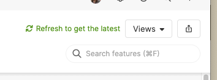

# Automatically reload when requested
  
Aha! keeps a persistent connection to the server to stream updates to the client. These updates are interrupted when the tab is hidden for a long time (e.g. when you close your laptop for the night). Aha! shows a message in the UI encouraging the user to reload the page to enable automatic updates again.



This extension uses the Page Visibility API to check for this message on the page every time a tab is focused. It automatically reloads the page if it finds it.

## Installing the extension

**Note: In order to install an extension into your Aha! Develop account, you must be an account administrator.**

This extension does not provide a pre-built package. You'll need to checkout this repo and install the extension using `aha-cli`. Follow the instructions below.

## Working on the extension

Install [`aha-cli`](https://github.com/aha-app/aha-cli):

```sh
npm install -g aha-cli
```

Clone the repo:

```sh
git clone https://github.com/trydionel/auto-reload-aha
```

**Note: In order to install an extension into your Aha! Develop account, you must be an account administrator.**

Install the extension into Aha! and set up a watcher:

```sh
aha extension:install
aha extension:watch
```

Now, any change you make inside your working copy will automatically take effect in your Aha! account.

## Building

When you have finished working on your extension, package it into a `.gz` file so that others can install it:

```sh
aha extension:build
```

After building, you can upload the `.gz` file to a publicly accessible URL, such as a GitHub release, so that others can install it using that URL.

To learn more about developing Aha! Develop extensions, including the API reference, the full documentation is located here: [Aha! Develop Extension API](https://www.aha.io/support/develop/extensions)
